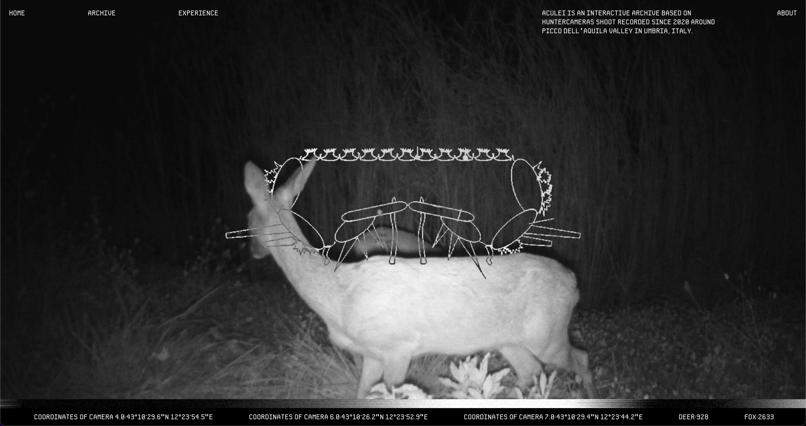


We are migrating so website may be slow or even unavailable


[` See it live`](https://aculei.xyz)
[` Backup link`](https://aculei-fe.onrender.com)

`aculei` is an online photo archive that collects hunter-cameras images shot in Umbria (Italy). It is divided into 3 components: a frontend, a backend and a command line application.

## Documentation

[` Read the paper`](https://drive.google.com/file/d/1aJPbHsFUKlRXWCtu9vfiDBtc7OOQf5Ai/view?usp=drive_link)

## Repository

Repositories are grouped under a [`GitHub`](https://github.com/aculei) organization.




