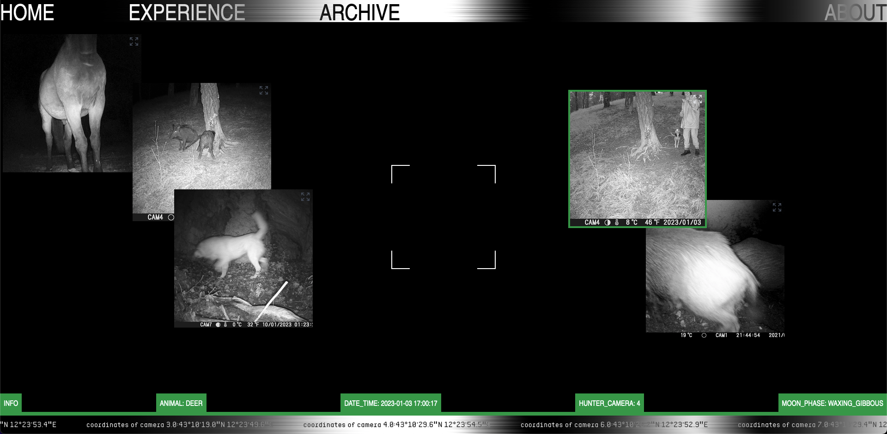

Aculei is an AI driven photo archive. It shows hunter cameras photos took automatically in an Umbria forest.



[paper here](https://drive.google.com/file/d/1aJPbHsFUKlRXWCtu9vfiDBtc7OOQf5Ai/view?usp=drive_link)

[see it live here](https://aculei.xyz)
