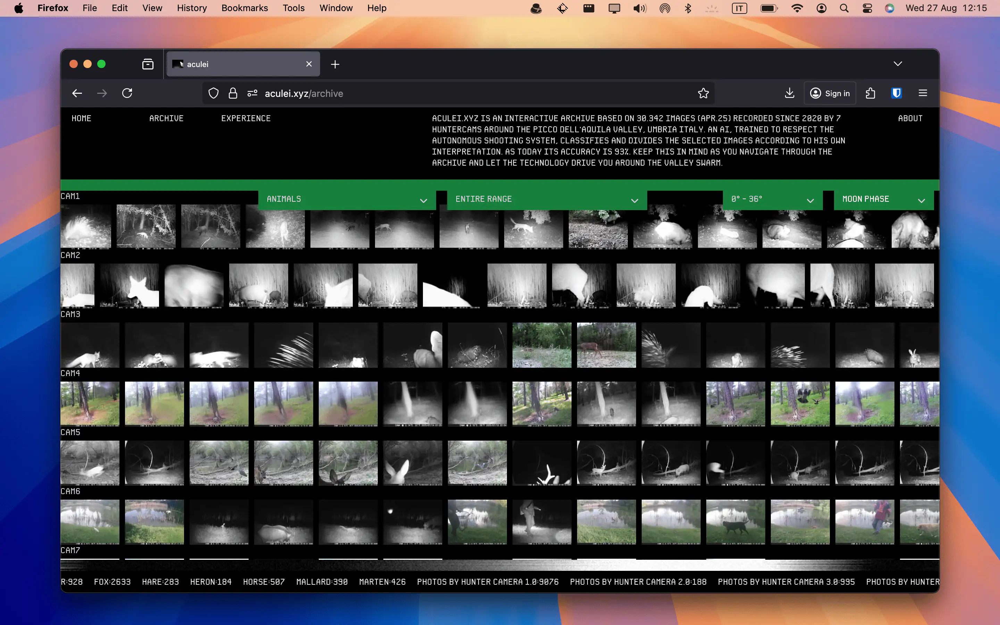

See it live [https://aculei.xyz](https://aculei.xyz)

Aculei is interactive photo archive that collects images from 7 hunter cameras deployed around Picco dell’Aquila (Umbria, Italy).

A zero-shot image classification model identify animals and labels images. The infrastruc-
ture consists of a Go backend, an Angular frontend, a MongoDB database and Redis. It is hosted on a 1 vCPU
512 MB RAM droplet and maintained regularly by me. Deployments are carried out using Ansible and Github
actions. There is also a backend that collects analytics and it is hosted on a Google Cloud e2-micro. Frontend
and domain records are managed using Cloudflare and Cloudflare pages