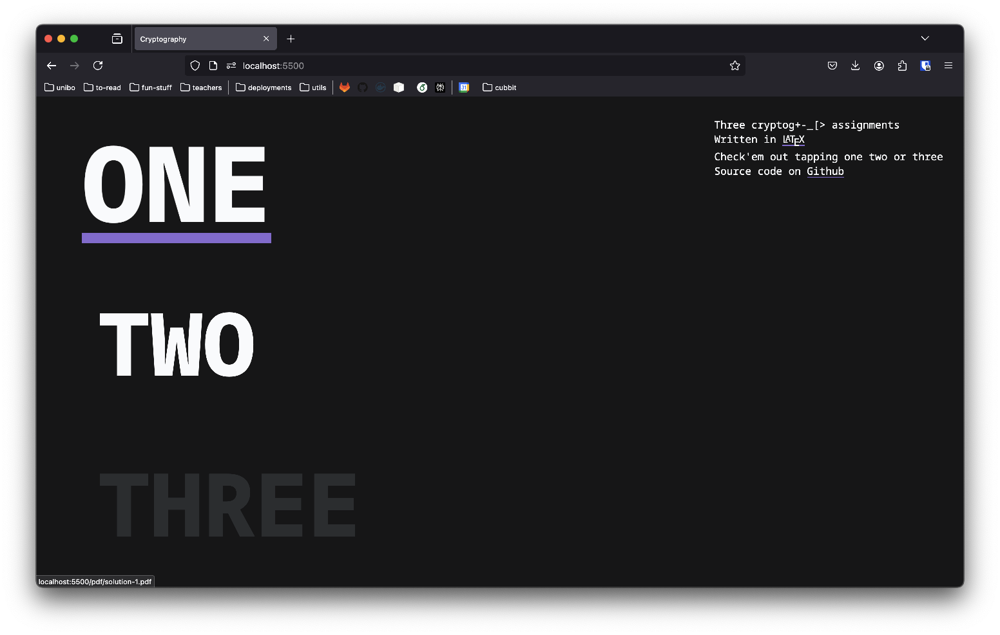

[` See it live`](https://micheledinelli.github.io/cryptography)

`cryptography` is a collection of

\\( \LaTeX \\)
assignments solutions written for [Cryptography](https://www.unibo.it/en/study/phd-professional-masters-specialisation-schools-and-other-programmes/course-unit-catalogue/course-unit/2024/487978) university course @unibo.

<!-- ## Repository

Repository on [`GitHub`](https://github.com/micheledinelli/where-i-wrote-this)

 -->
