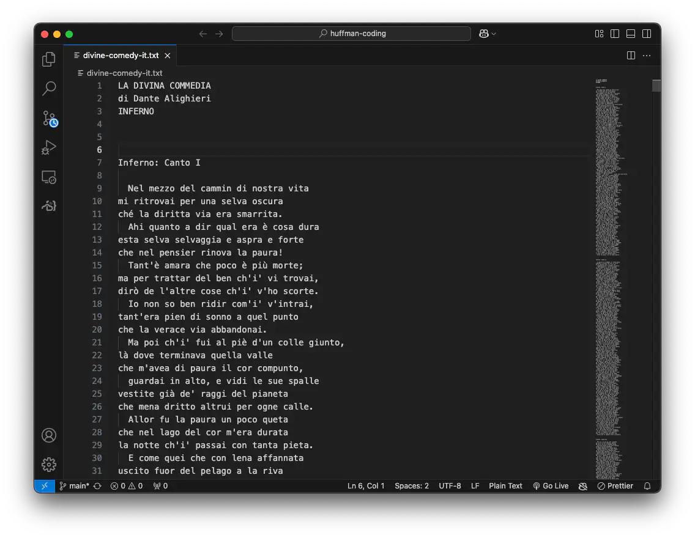
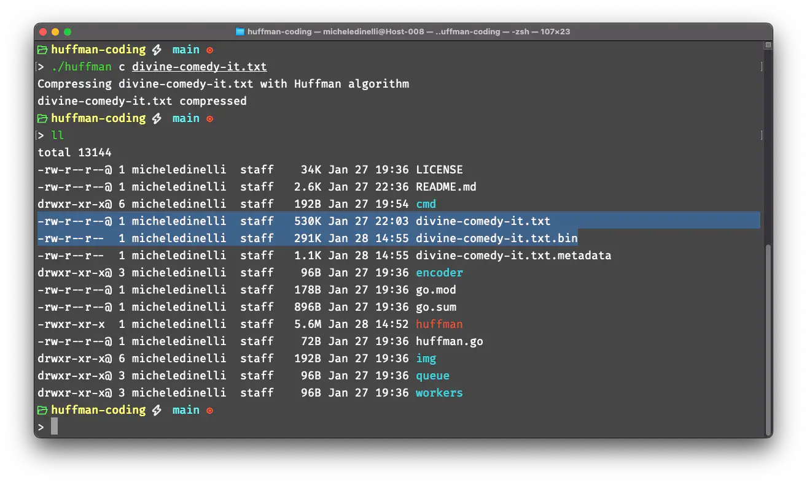
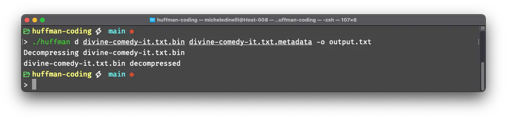
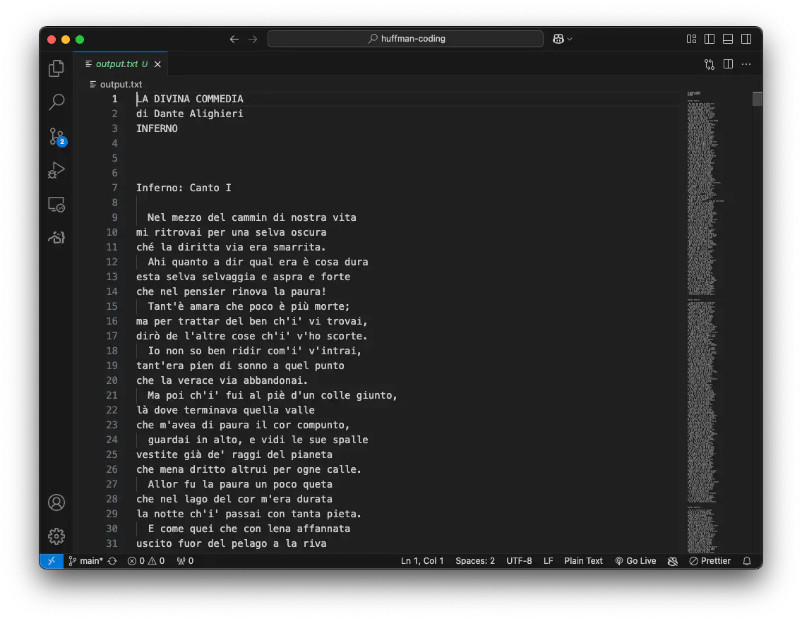

A few weeks ago I read a couple of articles online about efficient data compression.
It made me remember that during bachelor's degree we saw [Huffman coding](https://en.wikipedia.org/wiki/Huffman_coding),
an algorithm that generates prefix-free binary codes starting from a set of characters and their frequencies. It can be used to
efficiently compress file because the characters with the highest frequencies are converted into short bitstrings. I wanted to try to implement it from scratch using Go.

The project became a command line application (cli) for lossless file compression featuring vanilla Huffman coding. The cli has been developed using [cobra](https://cobra.dev/).

To try Huffman coding I downloaded a `.txt` version of the Divine Comedy by Dante Alighieri and I tried to compress it using the cli.

After compressing it with the command `./huffman c divine-comedy-it.txt` the cli generates two files:

- `divine-comedy-it.txt.bin`: the compressed file
- `divine-comedy-it.txt.metadata`: contains the dictionary used to compress the original file

As shown below the `.bin` version is almost one half of the size (291KB) compared to the original file (530KB), in fact it is approximately `45% smaller`.

To decompress the file and get back the original version the cli provides a command which takes as inputs the compressed file and its metadata. You can even specify the output filename with the flag `-o` as shown below where `-o output.txt` is passed.

Once the cli decompress the file you can see the file back to normal!

Repository on [`GitHub`](https://github.com/micheledinelli/huffman-coding)


