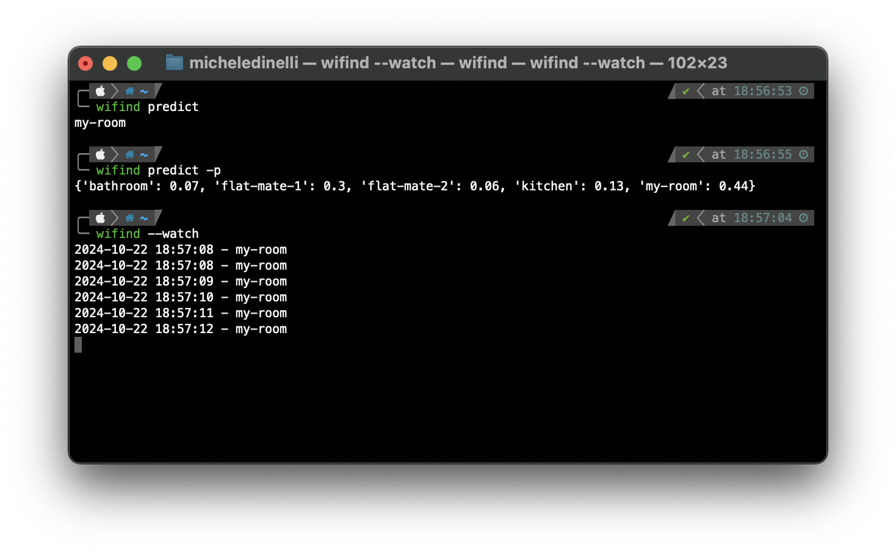

`wifind` is a command line application that performs radio (wifi) finger-printing. It collects access points signal strengths and uses a machine learning model to predict positions given collected samples.



## Some available commands

```console
# learn current location labelling it as kitchen
wifind learn -r kitchen

# print saved locations
wifind rooms
# ['kitchen', 'bedroom']

# predicts current location
wifind predict
# kitchen

wifind --watch
# 2024-06-08 12:31:24 - kitchen
# 2024-06-08 12:31:27 - bedroom
# 2024-06-08 12:31:31 - bedroom
# 2024-06-08 12:31:35 - bedroom

wifind predict -p
# {'kitchen': 0.68, 'bedroom': 0.32}

# clears data
wifind clear
```

## Installation

If you have `pip` installed simply run

```console
pip install wifind
```

and you are ready to go

## Repository

Repository on [`GitHub`](https://github.com/micheledinelli/wifind)


