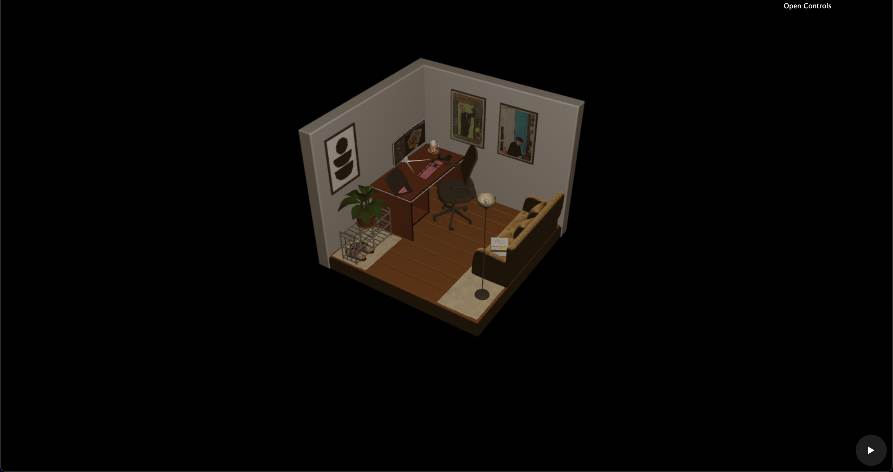
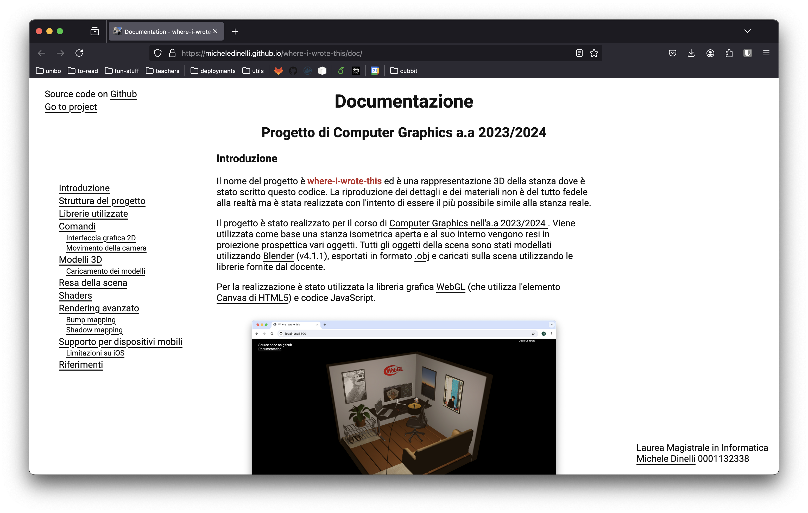

[` See it live`](https://micheledinelli.github.io/where-i-wrote-this)

`where-i-wrote-this` tries to represent my room in 3D.
This project runs on any browser suffering some limitations on mobile IOS. The project is realized for [Computer Graphics](https://www.unibo.it/it/studiare/dottorati-master-specializzazioni-e-altra-formazione/insegnamenti/insegnamento/2023/479028) university course. 3D models exported from Blender are rendered and rasterized using shaders written in GLSL and some help from a javascript matrix library.

## Documentation

Full documentation is available [` here`](https://micheledinelli.github.io/where-i-wrote-this/doc)

## Repository

Repository on [`GitHub`](https://github.com/micheledinelli/where-i-wrote-this)


