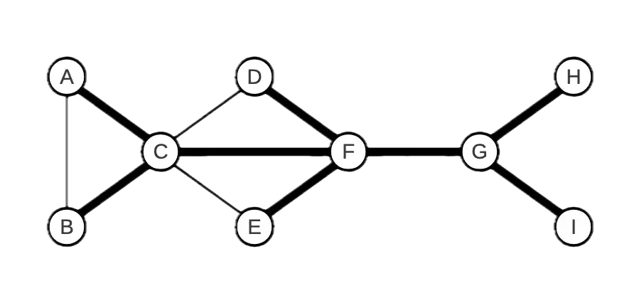

This is lecture's content for Bachelor's degree in computer science for management @unibo. These are exercises on graph data structures.

## Exercise 1

Consider the following undirected graph: 



1. Can the bold edges represent a spanning tree obtained by a depth-first search of the graph? If yes, specify the starting node of the traversal and represent the graph using adjacency lists so that the order of the elements in the lists allows the `DFS` algorithm to produce exactly the tree shown.

2. Can the bold edges represent a spanning tree obtained by a breadth-first search of the graph? If yes, specify the starting node of the traversal and represent the graph using adjacency lists so that the order of the elements in the lists allows the `BFS` algorithm to produce exactly the tree shown.

### Solution

The answer is affirmative in both cases. For the depth-first traversal, one can start, for example, from A or B. For the breadth-first traversal, one can start, for example, from F. In both cases (apart from the starting node, which differs between DFS and BFS), the tree shown in the text can be obtained using, for example, the following representation with adjacency lists: Naturally, other correct solutions were possible.


## Exercise 2

Write an efficient algorithm to calculate the number of distinct shortest paths from a source node \\( s \\) to each node \\( u \\) in an undirected, unweighted, and connected graph \\( G = (V, E) \\). Two paths are considered distinct if they differ by at least one edge. Note that there is one shortest path (the empty path) from \\( s \\) to itself. Apply the algorithm to the following graph:


### Solution

The breadth-first search (BFS) algorithm can be used to find a shortest path between a source node \\( s \\) and each node reachable from \\( s \\). However, we can extend it to calculate the number of distinct shortest paths between \\( s \\) and the nodes reachable from it. Recall that the BFS algorithm visits nodes in non-decreasing order of distance from the source. First, the node \\( s \\) (which is at distance 0 from itself) is visited, then the adjacent nodes at distance 1, then those at distance 2, and so on. Suppose we have already calculated the number of shortest paths \\( c[u] \\) for each node \\( u \\) that is at distance \\( k \\) from the source. The number of shortest paths leading to a node \\( v \\) that is at distance \\( k + 1 \\) can be expressed as:

$$
    c[v] = \sum_{\{[u,v]\} \in E, \ \{d[u]=k\}} c[u]
$$

For example, consider the following situation where nodes \\( x, y, z\\) are at distance \\(k\\) from \\(s\\) and are connected by an edge to node \\(v\\), which is at distance \\(k + 1\\). Assuming the numbers \\(c[x], c[y], c[z]\\) of distinct shortest paths from \\(s\\) to (respectively) \\(x, y, z\\) have already been calculated, then we can reach \\( v \\) through \\( c[x] \\) distinct paths passing through \\( x \\), \\( c[y] \\) distinct paths passing through \\( y \\), and \\( c[z] \\) distinct shortest paths passing through \\( z \\).


The value \\( c[v] \\) can be calculated for each node \\( v \\) as the graph is visited. Initially, set \\( c[v] ← 0 \\) for every \\( v \\), except for the source \\( s \\), where \\( c[s] \leftarrow 1 \\) since there is only one shortest path (the empty path) from the source to itself. Each time the BFS algorithm traverses the undirected edge \\(\{u, v\}\\) leading from node \\( u \\) to a node \\( v \\) at distance \\( d[v] = d[u] + 1 \\), update \\( c[v] \leftarrow c[v] + c[u] \\).

```java
countPaths( graph G = (V, E), node s )
    integer d[1..n], c[1..n]
    integer u, v;
    for v ← 1 to n do
        d[v] ← +∞;
        c[v] ← 0;
    endfor
    Queue Q;
    c[s] ← 1;
    d[s] ← 0;
    Q.insert(s);
    while ( not Q.empty() ) do
        u ← Q.dequeue();
        foreach v adjacent to u do
            if ( d[v] == +∞ ) then d[v] ← d[u] + 1;
                Q.insert(v);
            endif
            if ( d[v] == d[u] + 1 ) then
                c[v] ← c[v] + c[u];
                endif
            endfor
    endwhile
```

The cost of the `countPaths` algorithm is the same as a breadth-first traversal, i.e. \\(O(n+m)\\). In the following example, we label each node of the graph with the number of shortest paths from \\(s\\).


## Exercise 3

A remote city is located on a set of \\(n\\) islands, each uniquely identified by an integer \\(1,\dots, n1, \dots, n\\). The islands are connected by bridges, which can be crossed in both directions. Thus, we can represent the city as an undirected graph \\(G=(V,E)G\\), where \\(V\\) represents the set of \\(n\\) islands and \\(E\\) the set of bridges. Each bridge \\(\{u,v\}\\) can support a weight less than or equal to \\(W[u,v]\\). The matrix \\(W\\) is symmetric (so \\(W[u,v]=W[v,u]\\)), and the weights are positive real numbers. If there is no bridge directly connecting \\(u\\) and \\(v\\), we set \\(W[u,v]=W[v,u]= \infin \\)

A truck of weight \\(P\\) is located on island \\(s\\) (source) and must reach island \\(d\\) (destination). To do this, it can only use bridges capable of supporting its weight. Write an algorithm that, given the matrix \\(W\\), the weight \\(P\\), and the integers \\(s\\) and \\(d\\), returns the minimum number of bridges required to reach \\(d \ \text{from} \ s\\), if possible. Print the sequence of islands traversed.

### Solution

We use a breadth-first search algorithm modified appropriately to avoid crossing bridges that cannot support the weight \\(P\\).

```java
ATTRAVERSAISOLE( real W[1..n, 1..n], real P, integer s, integer d ) → integer
    integer parent[1..n], dist[1..n];
    Queue Q;
    for v ← 1 to n do
        parent[v] ← -1;
        dist[v] ← +inf;
    endfor
    dist[s] ← 0;
    Q.ENQUEUE(s);
    while ( ! Q.ISEMPTY() ) do
        integer u ← Q.DEQUEUE();
        if ( u == d ) then
            break; // exit the loop if the destination node is dequeued
        endif
        for v ← 1 to n do
            if ( W[u,v] >= P and dist[v] == +∞ ) then
                dist[v] ← dist[u] + 1; parent[v] ← u; Q.ENQUEUE(v);
            endif
        endfor
    endwhile

    if ( dist[d] == +∞ ) then
        print “no path”
    else
        integer i ← d;
        while ( i != -1 ) do
            print i;
            i ← parent[i];
        endwhile;
    endif
    return dist[d]; // minimum number of bridges traversed
```

By **Jocelyne Elias** and **Moreno Marzolla**