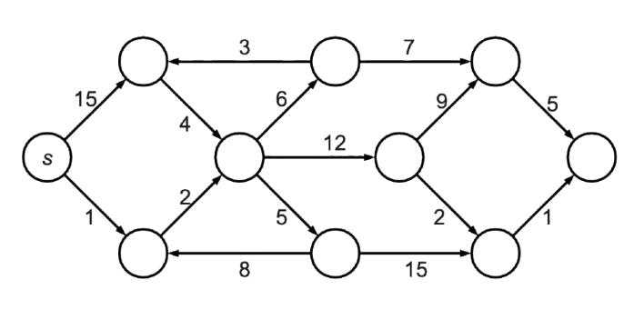
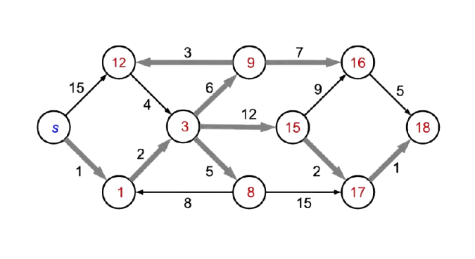

## Exercise 1

Consider the oriented graph \\(G = (V, E)\\) and notice that it's connected only with positive weight edges:



Manually apply Dijkstra algorithm to compute a shortest path tree starting from \\(s\\). Show the final result adding for each node the minimum distance from \\(s\\), highlighting the edges that leads to the shortest path.

### Solution



## Exercise 2

A road network is described using an oriented and weighted graph \\(G = (V, E, w)\\). For each edge \\((u, v)\\) the function \\(w(u, v)\\) describes the amount of gas (in liters) to go from \\(u \ \text{to} \ v\\) and it always returns a positive number. A vehicle can store up to \\(C\\) liters of gas in its tank and starts with full tank. There are no gas stations along the way. It is required to write an efficient algorithm that takes \\(G, C, s, d\\), respectively the graph, the gas capacity and two nodes \\(s, d\\) and returns true if and only if exists a shortest path from \\(d \ \text{to} \ s\\) without emptying the tank.

### Solution

It is possibile to execute Dijkstra's algorithm and calculate the vector \\(D[v]\\) of the minimum distances from the source \\(s\\) to each node \\(v\\) reachable from \\(s\\), using fuel consumption as weight. It is possible to interrupt the execution of Dijkstra's algorithm as soon as \\(d\\) is reached or the cost \\(C\\) is exceeded. The algorithm returns true if and only if \\(d\\) is reached and \\(C\\) is not exceeded.

## Exercise 3

Consider an oriented weighted graph, composed of the nodes \\({A, B, C, D, E}\\), whose adjacency matrix is described as follows (empty cells indicate the absence of the corresponding edge; the header of each row indicates the source node, while the header of the column indicates the destination node):

```txt {style=base16-snazzy}
+---+---+---+---+---+---+
|   | A | B | C | D | E |
+---+---+---+---+---+---+
| A |   | 2 | 8 |   |   |
+---+---+---+---+---+---+
| B |   |   | 7 | 9 |   |
+---+---+---+---+---+---+
| C |   |   |   |   | 1 |
+---+---+---+---+---+---+
| D |   |   | -4|   |   |
+---+---+---+---+---+---+
| E |   |   |   |   |   |
+---+---+---+---+---+---+
```

1. Draw the graph corresponding to the adjacency matrix.
2. Determine the minimum distance of each node from the source node \\(A\\). Which of the algorithms seen in class can be used?

### Solution


Note that the edge \\((D, C)\\) has a negative weight; therefore, to compute the minimum distances, it is not possible to use Dijkstra's algorithm, and one must resort to, for example, the Bellman-Ford algorithm. The iterations of the algorithm are indicated below (the gray nodes are those whose distance changes):

## Exercise 4

Consider an oriented graph \\(G = (V, E)\\) whose edges have non-negative weights. Let \\(w(u, v)\\) denote the weight of the directed edge \\((u, v)\\). Recall that Dijkstra's algorithm for computing shortest paths from a single source \\(s\\) has the following generic structure:

```go {style=base16-snazzy}
Tree dijkstra(graph G = (V, E), node s)
    intialize D such that D[s] = 0 and D[v] = +infinity for every v != s;
    T ← tree formed by the single vertex s;
    while ( T has less than n nodes ) do
        find the edge (u,v) incident on T with D[u] + w(u,v) minimum;
        D[v] ← D[u] + w(u,v);
        make u the parent of v in T;
    end while
    return T;
```

1. Write a version of Dijkstra's algorithm that does not use a priority queue but a simple list, so that at each step it systematically examines the incident edges to identify the one that minimizes the distance.

2. Determine the computational cost of the variant of Dijkstra's algorithm described in point 1. Specify which data structure is used to represent the graph.

### Solution

Suppose that, for each vertex \\(v\\), the distance between the source \\(s\\) and \\(v\\) is indicated by the attribute \\(v.d\\); we can then write the variant of Dijkstra's algorithm as follows:

```go {style=base16-snazzy}
Tree dijstraWithLists(graph G=(V, E, w), node s)
    foreach v in V do
        v.d := +infinity
    endfor
    s.d := 0;
    T := tree formed by the single vertex s;
    List L;
    L.INSERT(s); // insert s into L
    while (! L.ISEMPTY()) do
        u is the node in L with minimum value u.d // O(n) worst case
        remove u from L // cost: O(1) if L is a doubly linked list
        foreach (u, v) in E do
            if(v.d == +infinity) then
                v.d := u.d + w(u,v);
                make u the parent of v in T;
                L.INSERT(v); // v wasn't in the list, add it. Cost O(1)
            elseif (u.d + w(u,v) < v.d) then
                v.d := u.d + w(u,v);
                make u the parent of v in T;
                // v was already in the list, no need to reinsert
            endif
        endfor
    endwhile
    return T;
```

Note that the algorithm `dijstraWithLists` is slightly simpler to describe than the Dijkstra algorithm implemented with priority queues seen in class. In fact, in the case where \\(u.d + w(u, v) < v.d\\), that is, in the case where we have discovered a shorter path between \\(s\\) and \\(v\\) that passes through node \\(u\\), node \\(v\\) does not need to be reinserted into the data structure (in our case the list), because it is certainly already contained.

The computational cost of `dijstraWithLists` is \\(O(n^2)\\), with \\(n\\) being the number of nodes in the graph.

1. The while loop is executed at most \\(n\\) times. This is because at each iteration a node is extracted from the list, and once a node is extracted it is never reinserted (this is the same reasoning we used to compute the computational cost of the Dijkstra algorithm implemented with priority queues);

2. Each individual operation of searching for the node \\(u\\) such that \\(u.d\\) is minimum has cost \\(O(n)\\). In fact, the list \\(L\\) will contain at most \\(n\\) nodes (since the graph has \\(n\\) nodes) and must be scanned in its entirety, since it is not kept in any particular order. Since this operation is performed once for each of the \\(n\\) nodes extracted from the list (see previous point), the overall cost is \\(O(n^2)\\);

3. The body of the foreach loop is executed a total of \\(O(m)\\) times during the entire execution of the algorithm. In fact, each edge of the graph is visited exactly once.

Combining the above, the cost of the algorithm is \\(O(n^2) + O(m) = O(n^2)\\), given that in a graph we always have \\(m = O(n^2)\\) because the maximum number of edges in a directed graph is \\(n(n - 1)\\).
