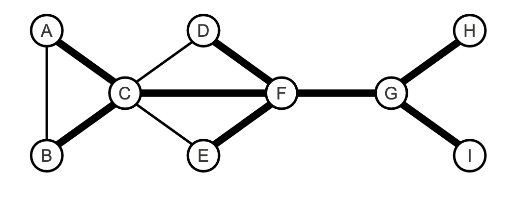
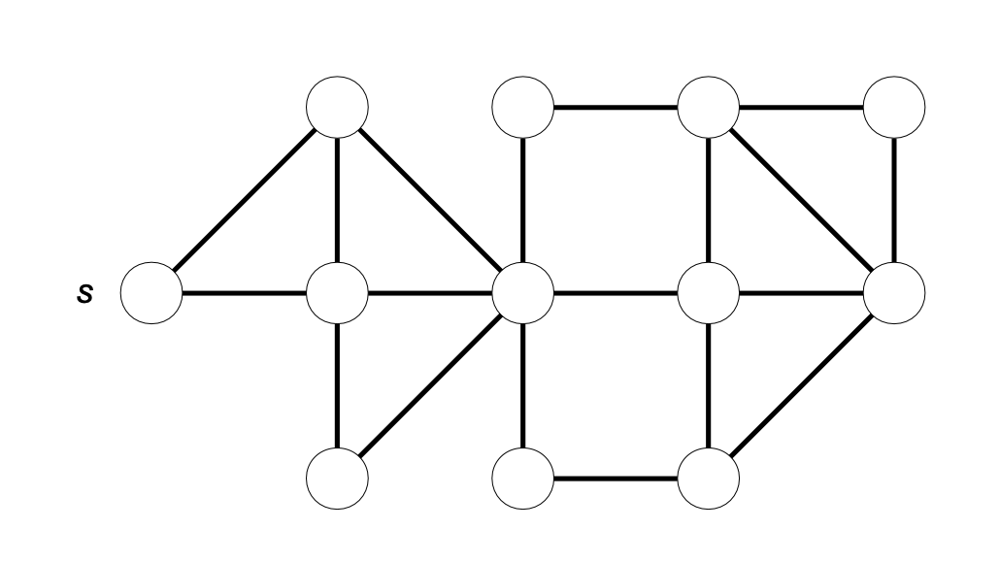

This is lecture's content for Bachelor's degree in Computer Science and Management. These are exercises on graph data structures.

# Esercizio 2

⏱️ 15 min

Considerare il seguente grafo non orientato:

1. Gli archi in grassetto possono rappresentare un albero di visita ottenuto mediante una **visita in profondità** del grafo? In caso affermativo specificare il **nodo di inizio** della visita, e rappresentare il grafo mediante **liste di adiacenza** in modo tale che l'ordine in cui compaiono gli elementi nelle liste consenta all'algoritmo DFS di produrre esattamente l'albero mostrato.

2. Gli archi in grassetto possono rappresentare un albero di visita ottenuto mediante una **visita in ampiezza** del grafo? In caso affermativo specificare il **nodo di inizio** della visita, e rappresentare il grafo mediante **liste di adiacenza** in modo tale che l'ordine in cui compaiono gli elementi nelle liste consenta all'algoritmo BFS di produrre esattamente l'albero mostrato.

# Esercizio 3

⏱️ 20 min

Scrivere un algoritmo efficiente per calcolare il numero di cammini minimi distinti che vanno da un nodo sorgente s a ciascun nodo u in un grafo non orientato G = (V, E) non pesato e connesso. Due cammini si considerano diversi se differiscono per almeno per un arco; si noti che esiste un cammino minimo (il cammino vuoto) dal nodo s a se stesso. Applicare l'algoritmo al grafo seguente:

# Esercizio 4

⏱️ 20 min

Una remota città sorge su un insieme di n isole, ciascuno identificato univocamente da un intero 1, ..., n. Le isole sono collegate da ponti, che possono essere attraversati in entrambe le direzioni. Quindi possiamo rappresentare la città come un grafo non orientato G = (V, E), dove V rappresenta l'insieme delle n isole ed E l'insieme dei ponti. Ogni ponte {u, v} è in grado di sostenere un peso minore o uguale a W[u, v]. La matrice W è simmetrica (quindi il peso W[u, v] è uguale a W[v, u]), e i pesi sono numeri reali positivi. Se non esiste alcun ponte che collega direttamente u e v, poniamo W[u, v] = W[v, u] = -∞

Un camion di peso P si trova sull'isola s (sorgente) e deve raggiungere l'isola d (destinazione); per fare questo può servirsi unicamente dei ponti che siano in grado di sostenere il suo peso. Scrivere un algoritmo che, dati in input la matrice W, il peso P, nonché gli interi s e d, restituisca il numero minimo di ponti che è necessario attraversare per raggiungere d partendo da s, ammesso che ciò sia possibile. Stampare la sequenza di isolotti attraversati.

By **Jocelyne Elias** and **Moreno Marzolla**
