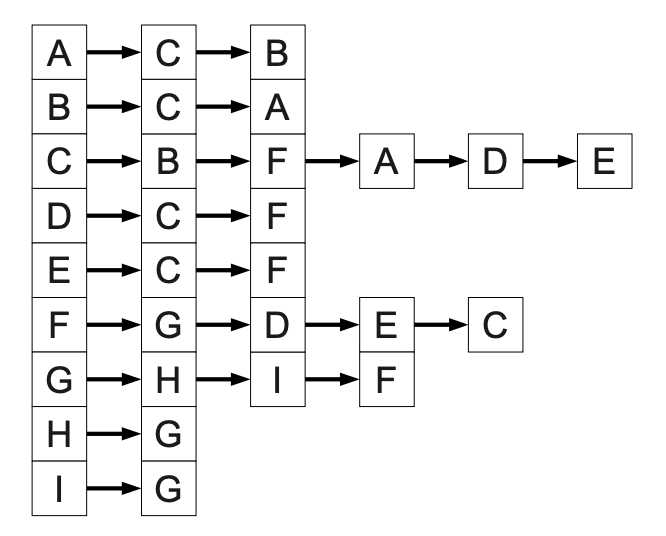
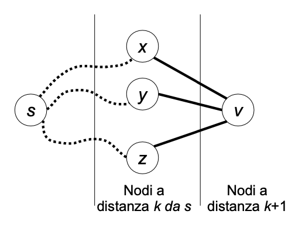
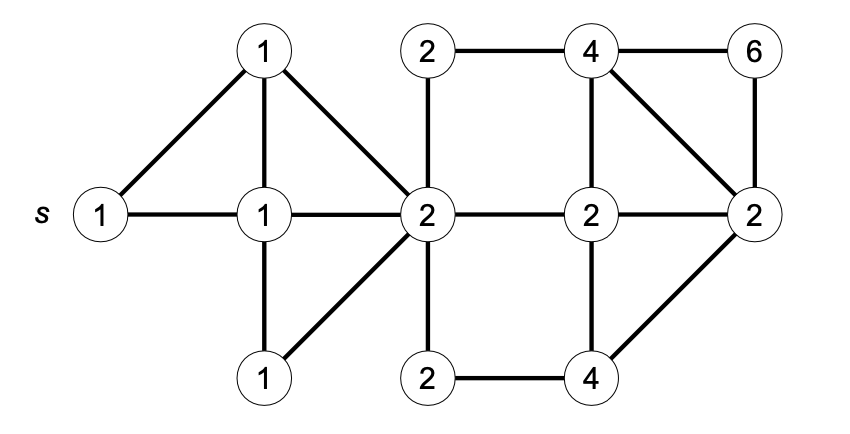

This is lecture's content for Bachelor's degree in Computer Science and Management. These are exercises on graph data structures.

## Esercizio 2

⏱️ 15 min

Considerare il seguente grafo non orientato:


1. Gli archi in grassetto possono rappresentare un albero di visita ottenuto mediante una **visita in profondità** del grafo? In caso affermativo specificare il **nodo di inizio** della visita, e rappresentare il grafo mediante **liste di adiacenza** in modo tale che l'ordine in cui compaiono gli elementi nelle liste consenta all'algoritmo DFS di produrre esattamente l'albero mostrato.

2. Gli archi in grassetto possono rappresentare un albero di visita ottenuto mediante una **visita in ampiezza** del grafo? In caso affermativo specificare il **nodo di inizio** della visita, e rappresentare il grafo mediante **liste di adiacenza** in modo tale che l'ordine in cui compaiono gli elementi nelle liste consenta all'algoritmo BFS di produrre esattamente l'albero mostrato.

### Soluzione

La risposta è affermativa in entrambi i casi. Per la visita in profondità si può ad esempio partire da A oppure B. Per la visita in ampiezza si può partire ad esempio da F. In entrambi i casi (al di là del nodo di partenza, che è differente per la visita DFS e BFS) si può ottenere l'albero di mostrato nel testo utilizzando, ad esempio, la seguente rappresentazione con liste di adiacenza: Naturalmente altre soluzioni corrette erano possibili.



## Esercizio 3

⏱️ 20 min

Scrivere un algoritmo efficiente per calcolare il numero di cammini minimi distinti che vanno da un nodo sorgente s a ciascun nodo u in un grafo non orientato G = (V, E) non pesato e connesso. Due cammini si considerano diversi se differiscono per almeno per un arco; si noti che esiste un cammino minimo (il cammino vuoto) dal nodo s a se stesso. Applicare l'algoritmo al grafo seguente:


### Soluzione

L'algoritmo di visita in ampiezza (BFS) può essere utilizzato per individuare un cammino minimo tra un nodo sorgente s e ciascun nodo raggiungibile da s; possiamo però estenderlo per calcolare il numero di cammini minimi distinti tra s e i nodi da esso raggiungibili. Ricordiamo che l'algoritmo BFS visita i nodi in ordine di distanza non decrescente dalla sorgente, ossia viene prima visitato il nodo s (che ha distanza 0 da se stesso), poi i nodi adiacenti a distanza 1, poi quelli a distanza 2 e così via. Supponiamo di aver già calcolato il numero di cammini minimi c[u] per ogni nodo u che si trovi a distanza k dalla sorgente. Il numero di cammini minimi che portano ad un nodo v che si trova a distanza k + 1 può essere espresso come:



$$
    c[v] = \sum_{\{[u,v\]} \in E, \ \{d[u]=k}} c[u]
$$

Ad esempio, consideriamo la situazione seguente in cui i nodi x, y, z si trovano a distanza k da s, e sono collegati con un arco al nodo v che si trova a distanza k + 1. Supponendo di aver già calcolato i numeri c[x], c[y] e c[z] di cammini minimi distinti da s a (rispettivamente) x, y e z, allora possiamo raggiungere v mediante c[x] cammini distinti che passano per x, c[y] cammini distinti che passano per y e c[z] cammini minimi distinti che passano per z.



È possibile calcolare il valore c[v] per ogni nodo v mano a mano che il grafo viene visitato. Si pone inizialmente c[v] ← 0 per ogni v, ad eccezione della sorgente s per cui si pone c[s] ← 1 in quanto esiste un solo cammino minimo (il cammino vuoto) dalla sorgente a se stessa. Ogni volta che l'algoritmo BFS attraversa l'arco non orientato {u, v} che conduce dal nodo u ad un nodo v a distanza d[v] = d[u] + 1, si imposta c[v] ← c[v] + c[u].

```java
CONTACAMMINIMINIMI( grafo G = (V, E), nodo s )
    integer d[1..n], c[1..n]
    integer u, v;
    for v ← 1 to n do
        d[v] ← +∞;
        c[v] ← 0;
    endfor
    Queue Q;
    c[s] ← 1;
    d[s] ← 0;
    Q.insert(s);
    while ( not Q.empty() ) do
        u ← Q.dequeue();
        foreach v adiacente a u do
            if ( d[v] = +∞ ) then d[v] ← d[u] + 1;
                Q.insert(v);
            endif
            if ( d[v] = d[u] + 1 ) then
                c[v] ← c[v] + c[u];
                endif
            endfor
    endwhile
```

Il costo dell'algoritmo CONTACAMMINIMINIMI è lo stesso di una visita in ampiezza, cioè O(n + m). Nell'esempio seguente etichettiamo ogni nodo del grafo con il numero di cammini minimi da s.



## Esercizio 4

⏱️ 20 min

Una remota città sorge su un insieme di n isole, ciascuno identificato univocamente da un intero 1, ..., n. Le isole sono collegate da ponti, che possono essere attraversati in entrambe le direzioni. Quindi possiamo rappresentare la città come un grafo non orientato G = (V, E), dove V rappresenta l'insieme delle n isole ed E l'insieme dei ponti. Ogni ponte {u, v} è in grado di sostenere un peso minore o uguale a W[u, v]. La matrice W è simmetrica (quindi il peso W[u, v] è uguale a W[v, u]), e i pesi sono numeri reali positivi. Se non esiste alcun ponte che collega direttamente u e v, poniamo W[u, v] = W[v, u] = -∞

Un camion di peso P si trova sull'isola s (sorgente) e deve raggiungere l'isola d (destinazione); per fare questo può servirsi unicamente dei ponti che siano in grado di sostenere il suo peso. Scrivere un algoritmo che, dati in input la matrice W, il peso P, nonché gli interi s e d, restituisca il numero minimo di ponti che è necessario attraversare per raggiungere d partendo da s, ammesso che ciò sia possibile. Stampare la sequenza di isolotti attraversati.

### Soluzione

Utilizziamo un algoritmo di visita in ampiezza modificato opportunamente per evitare di attraversare i ponti che non sosterrebbero il peso P.

```java
ATTRAVERSAISOLE( real W[1..n, 1..n], real P, integer s, integer d ) → integer
    integer parent[1..n], dist[1..n];
    Queue Q;
    for v ← 1 to n do
        parent[v] ← -1;
        dist[v] ← +inf;
    endfor
    dist[s] ← 0;
    Q.ENQUEUE(s);
    while ( ! Q.ISEMPTY() ) do
        integer u ← Q.DEQUEUE();
        if ( u = d ) then
            break; // esci dal ciclo se si estrae il nodo destinazione dalla coda
        endif
        for v ← 1 to n do
            if ( W[u,v] ≥ P and dist[v] = +∞ ) then
                dist[v] ← dist[u]+1; parent[v] ← u; Q.ENQUEUE(v);
            endif
        endfor
    endwhile

    if ( dist[d] = +inf ) then
        print “nessun percorso”
    else
        integer i ← d;
        while ( i ≠ -1 ) do
            print i;
            i ← parent[i];
        endwhile;
    endif
    return dist[d]; // numero minimo di isolotti attraversati
```

By **Jocelyne Elias** and **Moreno Marzolla**
