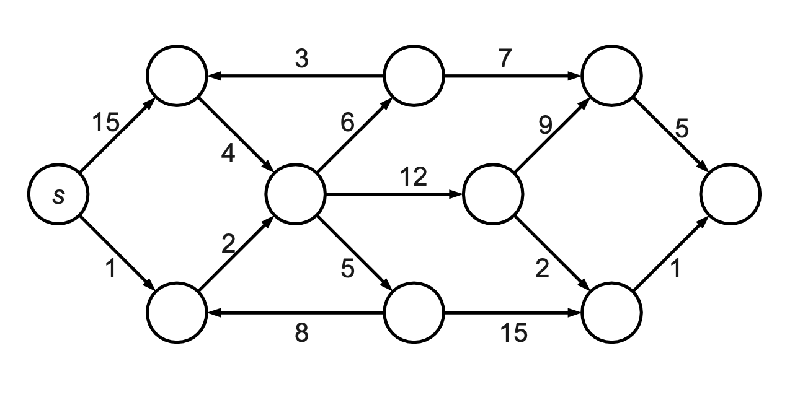
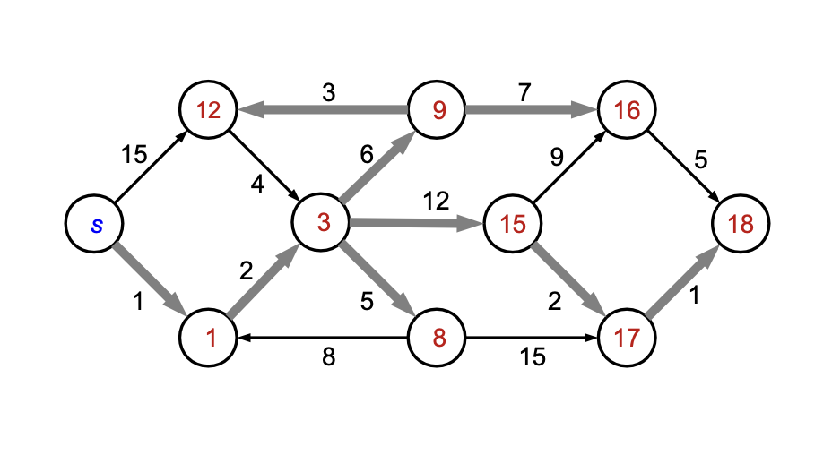
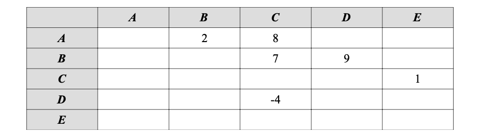
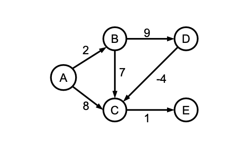
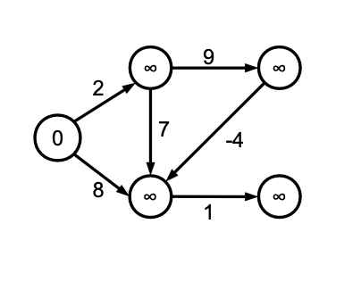
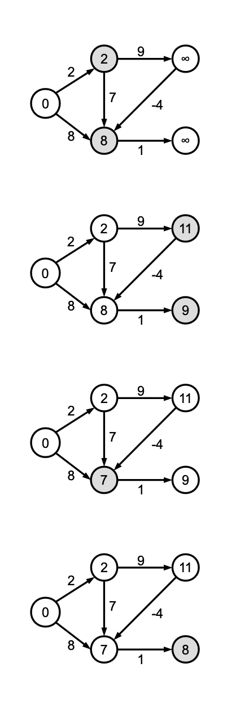

This is lecture's content for Bachelor's degree in Computer Science and Management. These are exercises on shortest path problem.

## Esercizio 1

Si consideri il grafo orientato G = (V, E), ai cui archi sono associati costi positivi come illustrato in figura:



Applicare "manualmente" l'algoritmo di Dijkstra per calcolare un albero dei cammini di costo minimo partendo dal nodo sorgente s. Mostrare il risultato finale dell'algoritmo di Dijkstra, inserendo all'interno di ogni nodo la distanza minima da s, ed evidenziando opportunamente (ad esempio, cerchiando il valore del costo) gli archi che fanno parte dell'albero dei cammini di costo minimo.

### Soluzione



## Esercizio 2

Una rete stradale è descritta da un grafo orientato pesato G = (V, E, w). Per ogni arco (u, v), la funzione costo w(u, v) indica la quantità di carburante (in litri) che è necessario consumare per percorrere la strada che va da u a v. Tutti i costi sono strettamente positivi. Un veicolo ha il serbatoio in grado di contenere C litri di carburante, inizialmente completamente pieno. Non sono presenti distributori di carburante. Scrivere un algoritmo efficiente che, dati in input il grafo pesato G, la quantità C di carburante inizialmente presente nel serbatoio, e due nodi s e d, restituisce true se e solo se esiste un cammino che consente al veicolo di raggiungere d partendo da s, senza esaurire il carburante durante il tragitto.

### Soluzione

È sufficiente eseguire l'algoritmo di Dijkstra e calcolare il vettore D[v] delle distanze minime dalla sorgente s a ogni nodo v raggiungibile da s, utilizzando il consumo di carburante come peso. È possibile interrompere l'esecuzione dell'algoritmo di Dijkstra appena si raggiunge d oppure si supera il costo C. L'algoritmo restituisce true se e solo se si raggiunge d e non si è superato C.

## Esercizio 3

Si consideri un grafo orientato pesato, composto dai nodi {A, B, C, D, E}, la cui matrice di adiacenza è la seguente (le caselle vuote indicano l'assenza dell'arco corrispondente; l'intestazione di ogni riga indica il nodo sorgente, mentre l'intestazione della colonna indica il nodo destinazione):



1. Disegnare il grafo corrispondente alla matrice di adiacenza.
2. Determinare la distanza minima di ciascun nodo dal nodo sorgente A. Quale degli algoritmi visti a
   lezione può essere impiegato?

### Soluzione



Si nota come l'arco (D, C) abbia peso negativo; quindi per calcolare le distanze minime non è possibile usare l'algoritmo di Dijkstra, e si deve ricorrere ad esempio all'algoritmo di Bellman-Ford. Le iterazioni dell'algoritmo sono indicate nel seguito (i nodi in grigio sono quelli la cui distanza cambia):




## Esercizio 4

Consideriamo un grafo orientato G = (V, E) i cui archi abbiano pesi non negativi. Denotiamo con w(u, v) il peso dell'arco orientato (u, v). Ricordiamo che l'algoritmo di Dijkstra per il calcolo dei cammini minimi da una singola sorgente s ha la seguente struttura generica:

```java
Tree DIJKSTRAGENERICO( grafo G = (V, E), nodo s )
    inizializza D tale che D[s] = 0 e D[v] = +∞ per ogni v ≠ s;
    T ← albero formato dal solo vertice s;
    while ( T ha meno di n nodi ) do
        trova l'arco (u,v) incidente su T con D[u] + w(u,v) minimo;
        D[v] ← D[u] + w(u,v);
        rendi u padre di v in T;
    end while
    return T;
```

1. Scrivere una versione dell'algoritmo di Dijkstra che non faccia uso di una coda di priorità ma di una semplice lista, in modo che ad ogni passo esamini sistematicamente gli archi incidenti per individuare quello che minimizza la distanza.

2. Determinare il costo computazionale della variante dell'algoritmo di Dijkstra descritta al punto 1. Specificare quale struttura dati viene usata per rappresentare il grafo.

### Soluzione

Supponiamo che, per ogni vertice v, la distanza tra la sorgente s e v sia indicata con l'attributo v.d; possiamo quindi scrivere la variante dell'algoritmo di Dijkstra come segue:

```java
Tree DIJKSTRACONLISTE( grafo G=(V, E, w), nodo s )
    foreach v in V do
        v.d := +∞
    endfor
    s.d := 0; // il nodo sorgente ha distanza zero da se stesso
    T := albero formato dal solo vertice s
    Lista L;
    L.INSERT(s); // inserisci s in L
    while ( ! L.ISEMPTY() ) do
        sia u il nodo di L con minimo valore u.d // costo: O(n) nel caso peggiore
        rimuovi u da L // costo: O(1) se L è una lista doppiamente concatenata
        foreach (u, v) in E do
            if(v.d == +∞) then
                v.d := u.d + w(u,v);
                rendi u padre di v in T;
                L.INSERT(v); // v non era nella lista, inseriscilo. Costo O(1)
            elseif (u.d + w(u,v) < v.d) then
                v.d := u.d + w(u,v);
                rendi u nuovo padre di v in T;
                // v era già nella lista, non va reinserito
            endif
        endfor
    endwhile
    return T;
```

Si noti che l'algoritmo DIJKSTRACONLISTE è leggermente più semplice da descrivere rispetto all'algoritmo di Dijkstra implementato con code di priorità visto a lezione. Infatti nel caso in cui u.d + w(u, v) < v.d, cioè nel caso in cui abbiamo scoperto un cammino più breve tra s e v che passa attraverso il nodo u, il nodo v non va reinserito nella struttura dati (nel nostro caso la lista), perché sicuramente vi è già contenuto.

Il costo di DIJKSTRACONLISTE è O(n^2), essendo n il numero di nodi del grafo. Notiamo infatti quanto segue:

1. Il ciclo while viene eseguito al più n volte. Questo perché ad ogni iterazione viene estratto un nodo dalla lista, e una volta estratto un nodo questo non viene più reinserito (questo è lo stesso ragionamento che abbiamo fatto per calcolare il costo computazionale dell'algoritmo di Dijkstra implementato tramite coda di priorità);

2. Ogni singola operazione di ricerca del nodo u tale che u.d sia minimo ha costo O(n). Infatti la lista L conterrà al più n nodi (in quanto il grafo ha n nodi) e va scansionata per intero, dato che non è mantenuta in alcun ordina particolare. Dato che questa operazione viene eseguita una volta per ciascuno degli n nodi estratti dalla lista (vedi punto precedente), il costo complessivo è O(n^2);

3. Il corpo del ciclo foreach viene eseguito in tutto O(m) volte durante l'intera esecuzione dell'algoritmo. Notiamo infatti che ogni arco del grafo viene visitato esattamente una volta.

Combinando quanto sopra, il costo dell'algoritmo è O(n^2) + O(m) = O(n^2), dato che in un grafo si ha sempre m = O(n^2) (perché il massimo numero di archi di un grafo orientato è n(n - 1) ).

By **Jocelyne Elias** and **Moreno Marzolla**

<!--
See also: [pdf version of this file](https://drive.google.com/file/d/125v-4dyBAHK25r5TzVWa8Q8S8TLEgvi4/view?usp=drive_link) -->
